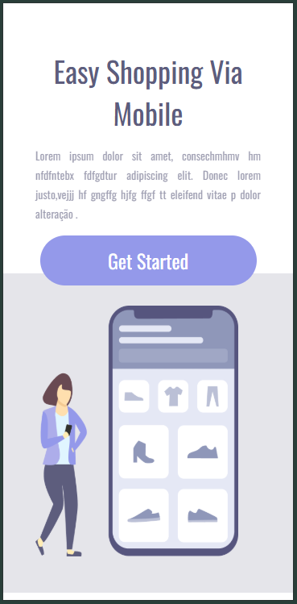

<h1> Projeto 'Easy Shopping Via Mobile' com aplicação de conhecimentos de responsividade via CSS: </h1>
<h2>Tipo de linguagens utilizadas:</h2> 
 

<a href="https://marlonprado2025.github.io/Responsividade/">Link do projeto</a>
 
 

